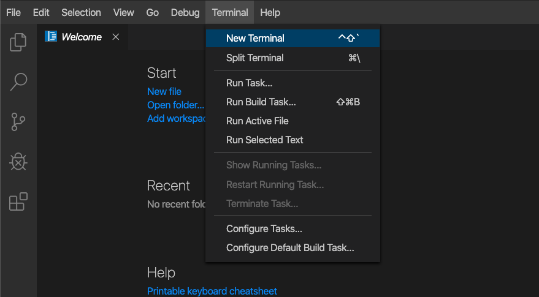

# Workshop Exercise - Check the Prerequisites

# Objective

- Understand the lab topology and how to access the environment.
- Understand how to work the workshop exercises


# Guide

## Your Lab Environment

In this lab you work in a pre-configured lab environment. You will have access to the following hosts:

| Role                 | Inventory name |
| ---------------------| ---------------|
| Ansible Control Host | ansible        |
| Managed Host 1       | node1          |
| Managed Host 2       | node2          |
| Managed Host 3       | node3          |

## Step 1 - Access the Environment

All automation is done from the Ansible control host, a Red Hat Enterprise Linux machine. To make access to the control host and managing files on it easier there is a online version of VS Code editor installed directly on the control host. This way it can be accessed via a normal web browser. Commands can be executed right from the terminal within the VS Code editor.

Let's access the Visual Studio Code. Click on the link for VS Code access from the workshop page:


At this point, you will see a **Welcome** page:


From within this environment, you can create and modify files or open a terminal and execute commands.

## Step 2 - Opening up Bash Terminal

So let's open a new terminal in VS Code. In the menu bar, click on **Terminal** > **New Terminal**. 



A new terminal will be opened in the lower part of your editor and you will be at the command prompt. Note that most prerequisite tasks have already been done for you:

  - Ansible software is installed

  - SSH connection and keys are configured

  - `sudo` has been configured on the managed hosts to run commands that require root privileges.

Note that each student is assigned a student number, i.e. X and you should work as that student <X> user on the control node if not explicitly told differently.

Next, proceed to check that Ansible has been installed correctly.

```bash
    [student<X>@ansible ~]$ ansible --version
```

The result should resemble the following:


## Step 3 - Working the Labs

You might have guessed by now this lab is pretty commandline-centric…​ :-)

  - Don’t type everything manually, use copy & paste from the browser when appropriate. But stop to think and understand.

> **Tip**
>
> In the lab guide commands you are supposed to run are shown with or without the expected output, whatever makes more sense in the context.


----
**Navigation**
<br>
[Next Exercise](../1.2-adhoc)
