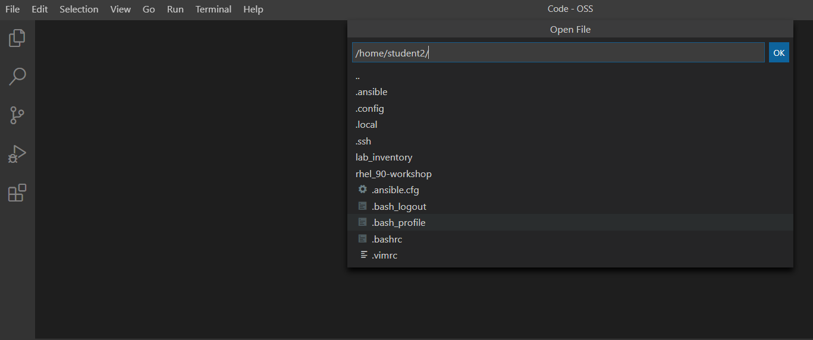

# Workshop Exercise - Running Ad-hoc commands

## Table of Contents

* [Objective](#objective)
* [Guide](#guide)
* [Step 1 - Work with your Inventory](#step-1---work-with-your-inventory)
* [Step 2 - The Ansible Configuration Files](#step-2---the-ansible-configuration-files)
* [Step 3 - Ping a host](#step-3---ping-a-host)
* [Step 4 - Listing Modules and Getting Help](#step-4---listing-modules-and-getting-help)
* [Step 5 - Use the command module:](#step-5---use-the-command-module)


# Objective

Ansible Ad-Hoc commands enable you to perform tasks on remote nodes without having to write a playbook.  

This exercise will cover
- Locating and understanding the Ansible configuration file (`ansible.cfg`)
- Locating and understanding an `ini` formatted inventory file
- Executing ad hoc commands

# Guide

## Step 1 - Work with your Inventory

To use the ansible command for host management, you need to provide an inventory file which defines a list of hosts to be managed from the control node. The inventory is an ini formatted file listing your hosts, sorted in groups, additionally providing some variables. It looks like:

```bash
[all:vars]
ansible_user=student1
ansible_ssh_pass=PASSWORD
ansible_port=22

[web]
node1 ansible_host=<X.X.X.X>
node2 ansible_host=<Y.Y.Y.Y>
node3 ansible_host=<Z.Z.Z.Z>

[control]
ansible ansible_host=44.55.66.77
```

Ansible is already configured to use the inventory specific to your environment. 

Ansible has a `--list-hosts` option which can be useful for clarifying which managed hosts are referenced by the host pattern in an ansible command.

The most basic host pattern is the name of all hosts in the inventory file. 
Run:

```bash
[student<X@>ansible ~]$ ansible all --list-hosts
```


> **Tip**
>
> The inventory can contain more data. E.g. if you have hosts that run on non-standard SSH ports you can put the port number after the hostname with a colon. Or you could define names specific to Ansible and have them point to the "real" IP or hostname.

## Step 2 - The Ansible Configuration Files

The behavior of Ansible can be customized by modifying settings in Ansible’s ini-style configuration file. 

> **Tip**
>
> The recommended practice is to create an `ansible.cfg` file in the directory from which you run Ansible commands. This directory would also contain any files used by your Ansible project, such as the inventory and playbooks. Another recommended practice is to create a file `.ansible.cfg` in your home directory.

In the lab environment provided to you an `.ansible.cfg` file has already been created and filled with the necessary details in the home directory of your `student<X>` user on the control node:

The view the file, click on the **File** menu button on the top left-hand corner of your Visual Studio code. And select **Open File**:
 

From the drop-down menu select `.ansible.cfg` which will display your ansible configuration file.

There are multiple configuration flags provided, but make sure to note the last line: where the location of the inventory is provided. That is the way Ansible knew in the previous commands what machines to connect to.

Now to view the inventory file, go back to the VS Code menu and go to **File > Open File** and in the drop-down select the **lab_inventory > hosts**.  Which will open the inventory file noted in your ansible.cfg. 

## Step 2 - Ping a host

Let's start with something really basic - pinging a host. To do that we use the Ansible `ping` module. The `ping` module makes sure our target hosts are responsive.  

> **Tip**
>
> Think of a module as a tool which is designed to accomplish a specific task.

Type the below bash commands in VS Code terminal which you opened in the previous exercise.  Ansible needs to know that it should use the `ping` module: The `-m` option defines which Ansible module to use. Options can be passed to the specified module using the `-a` option.

```bash
[student<X>@ansible ~]$ ansible web -m ping
node2 | SUCCESS => {
    "ansible_facts": {
        "discovered_interpreter_python": "/usr/bin/python"
    },
    "changed": false,
    "ping": "pong"
}
[...]
```

As you see each node reports the successful execution and the actual result - here "pong".


## Step 3 - Use the command module:

Now let's see how we can run a good ol' fashioned Linux command and format the output using the `command` module. It simply executes the specified command on a managed host:

```bash
[student<X>@ansible ~]$ ansible node1 -m command -a "id"
node1 | CHANGED | rc=0 >>
uid=1001(student1) gid=1001(student1) Gruppen=1001(student1) Kontext=unconfined_u:unconfined_r:unconfined_t:s0-s0:c0.c1023
```

> **Tip**
>
> Like many Linux commands, `ansible` allows for long-form options as well as short-form.  For example `ansible web --module-name ping` is the same as running `ansible web -m ping`.  We are going to be using the short-form options throughout this workshop.

----
**Navigation**
<br>
[Previous Exercise](../1.1-setup) - [Next Exercise](../1.3-playbook)
